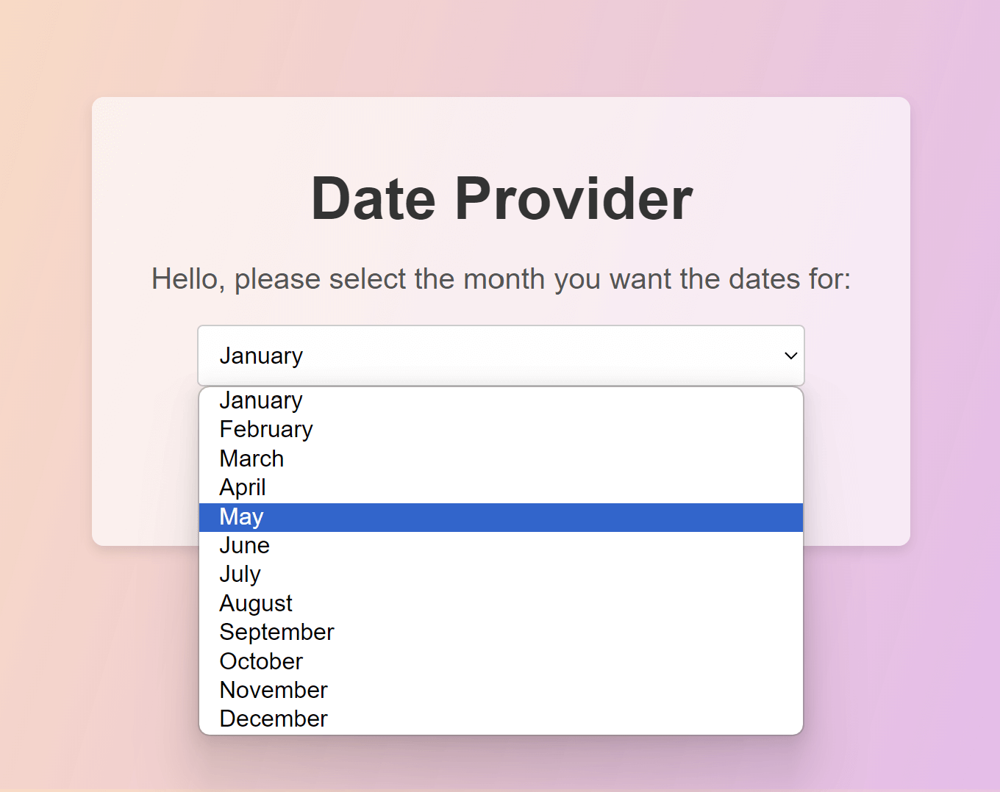
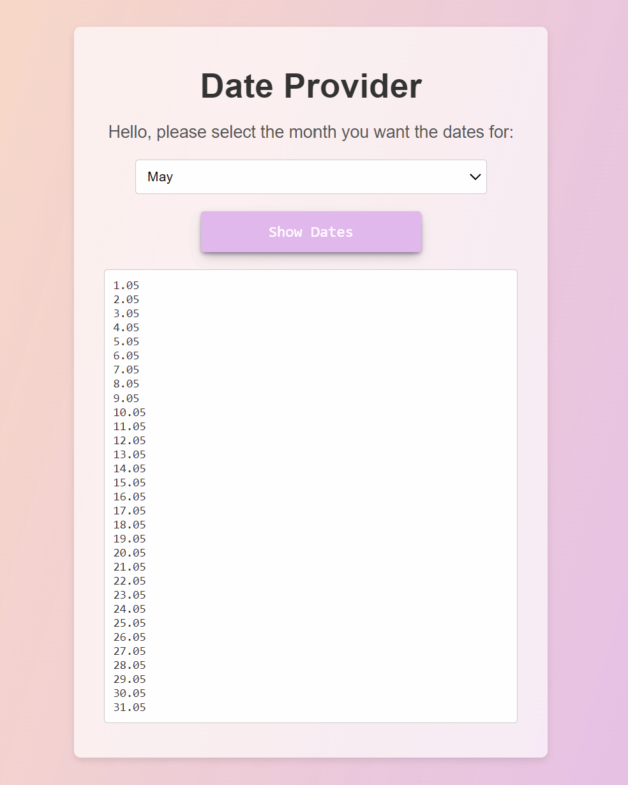

# MontlyDateDisplay

## Overview

**DatePicker** is a simple React app that allows users to select a month and view all the dates within that month. It is designed to help users quickly visualize the dates of any month in a clean and user-friendly interface.

## Features

- Dropdown to select any month.
- Display all dates for the selected month.

## Screenshots

## Installation

To run this project locally, follow these steps:

### Prerequisites

- Make sure you have **Node.js** installed on your machine.

### Setup

1. Clone the repository:
2. Navigate the project diractory
3. Install the dependecies

### Usage

1. Start the development server:
   npm run dev
2. Open your browser and go to http://localhost:3000.
3. Select a month from the dropdown to view all the dates for that month.
